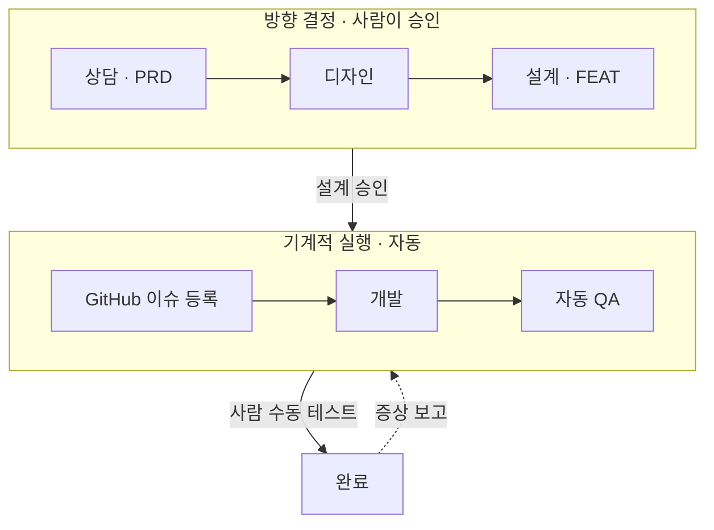

<picture>
  <source media="(prefers-color-scheme: dark)" srcset="https://capsule-render.vercel.app/api?type=waving&color=0:1f6feb%2C100:8957e5&height=170&section=header&text=Si%20Hyeon%20Lee&fontSize=46&fontColor=ffffff&fontAlignY=36&desc=Building%20internal%20tools%20with%20AI%20agents&descSize=17&descAlignY=60&animation=none">
  
</picture>

세무법인 사내 개발자. AI 에이전트로 실무 도구를 만듭니다. 
*최근 1년 기여의 대부분은 비공개 저장소에서 발생했습니다. 아래 연속 기록에는 포함되어 있습니다.*

 

### 지금 하는 일

- **세무법인 사내 업무 자동화** — 통화 기록 수집, 근태 판정, 담당자용 메모 도구를 만들고 직접 운영합니다. (비공개)
- **IT상상공방** — 단계마다 다른 에이전트가 이어받는 멀티에이전트 공정으로 개인 프로젝트를 생산하는 개인 프로젝트. 아래 대표 프로젝트들이 이 공정에서 나왔습니다.
- **AI Morning Brief** — AI 뉴스를 매일 수집·분석해 Discord로 보내는 파이프라인. 2026년 6월부터 매일 돌고 있습니다.

 

### 대표 프로젝트

**[sangsang-lite-mcp](https://github.com/LeeSiHyeon711/sangsang-lite-mcp)** · Python · MCP 
아이디어를 「만들 것」이 아니라 「먼저 확인할 것」으로 바꿔 주는 검증용 MCP 서버. 
`prepare_intake → diagnose_idea → design_first_experiment` 세 도구를 Streamable HTTP로 제공하고, 서버 안에서는 LLM을 호출하지 않아 도구당 p99 20ms 아래로 응답합니다. PlayMCP 제출용.

**[PickUpMemo_v2](https://github.com/LeeSiHyeon711/PickUpMemo_v2)** · Kotlin · Android 
배달 라이더가 배차 카드를 받는 30초 안에 가게 메모와 실제 경로 거리를 볼 수 있도록, 배민커넥트 화면 위에 팝업 하나를 자동으로 띄우는 앱. 
접근성 서비스로 화면을 읽고 시스템 오버레이로 그립니다. 카카오 지도 API. 실기기 동작 검증 완료.

**[TouchMemory](https://github.com/LeeSiHyeon711/TouchMemory)** · Python · Discord Bot + CLI 
`touch` 명령어처럼, 기억이 없으면 만들고 있으면 다시 꺼내 주는 개인용 기억 관리 도구. 
FastAPI + SQLite 중앙 API 하나를 Discord 봇과 Claude Code CLI가 함께 바라봅니다. 현재는 일정·태스크를 흡수한 Plandy(비공개)로 발전 중.

**[pawprint-diary](https://github.com/LeeSiHyeon711/pawprint-diary)** · TypeScript · Next.js 
반려동물의 하루 컨디션과 행동을 기록하면 AI가 요약·해석해 주는 local-first 웹 앱. 
기록은 브라우저 IndexedDB에만 저장하고, AI 호출은 서버 Route Handler를 거쳐 API 키를 노출하지 않습니다. 키가 없으면 Mock 모드로 전체 흐름이 돕니다.

 

### 활동

<picture>
  <source media="(prefers-color-scheme: dark)" srcset="https://streak-stats.demolab.com/?user=LeeSiHyeon711&theme=dark&hide_border=true&background=0D1117&date_format=Y.n.j">
  
</picture>

 

### 기술

그리고 아이콘이 없는 것들 — **Claude Code · MCP · Anthropic SDK · n8n**

 

글은 [Velog](https://velog.io/@hoya_711/posts)에 씁니다.
